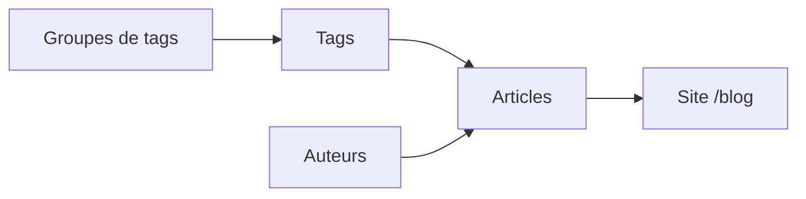

Une fois connecté, le menu de gauche est organisé dans la section **Blog** :

| Entrée du menu | Rôle |
| --- | --- |
| **Articles** | Vos publications de blog |
| **Auteurs** | Les rédacteurs (nom, photo, biographie) |
| **Groupes de tags** | Catégories de filtres (*Handicaps*, *Zones*) |
| **Tags** | Mots-clés filtrables, rattachés à un groupe |

<Warning>
  Les tags ne se créent **pas** directement dans un article. Ils existent d'abord comme fiches à part entière (déjà pré-configurées pour vous), puis vous les **sélectionnez** dans l'article.
</Warning>
