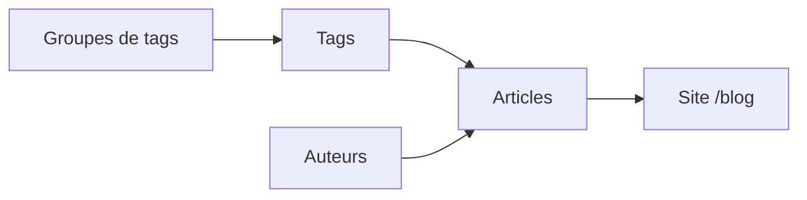

# Guide d'administration du blog Metalaxs

Bienvenue ! Ce document explique, **sans connaissances techniques**, comment gérer le contenu du blog depuis votre espace d'administration **Sanity Studio**.

Il couvre l'ensemble du parcours : préparation des tags, rédaction d'articles, mise en forme, publication, et ce que vos visiteurs voient sur le site.

---

## Sommaire

1. [Accéder au Studio](#1-accéder-au-studio)
2. [Vue d'ensemble](#2-vue-densemble)
3. [Parcours recommandé](#3-parcours-recommandé)
4. [Groupes de tags et tags](#4-groupes-de-tags-et-tags)
5. [Auteurs](#5-auteurs)
6. [Rédiger un article](#6-rédiger-un-article)
7. [Le surlignage vert](#7-le-surlignage-vert)
8. [Éditeur de contenu](#8-éditeur-de-contenu)
9. [Médias et images](#9-médias-et-images)
10. [Publier et gérer les articles](#10-publier-et-gérer-les-articles)
11. [Ce que voit le visiteur sur le site](#11-ce-que-voit-le-visiteur-sur-le-site)
12. [Bonnes pratiques](#12-bonnes-pratiques)
13. [Questions fréquentes](#13-questions-fréquentes)
14. [Captures d'écran](#14-captures-décran)

---

## 1. Accéder au Studio

L'espace d'administration s'appelle le **Studio**. C'est l'interface dans laquelle vous rédigez et publiez les articles — distincte du site public visité par les internautes.

### Adresses

| Environnement | Site public | Studio (administration) |
| --- | --- | --- |
| **Production** | [all-access-metal-38bhaa4w5-all-access-metal.vercel.app](https://all-access-metal-38bhaa4w5-all-access-metal.vercel.app) | […vercel.app/studio](https://all-access-metal-38bhaa4w5-all-access-metal.vercel.app/studio) |
| **Local** (tests techniques) | `http://localhost:3000` | `http://localhost:3000/studio` |

Pour accéder au Studio en production, ajoutez simplement **`/studio`** à la fin de l'URL du site :

```
https://all-access-metal-38bhaa4w5-all-access-metal.vercel.app/studio
```

> **Astuce.** Mettez cette adresse en favori dans votre navigateur : c'est votre point d'entrée quotidien pour gérer le blog.

### Se connecter

1. Vous recevez un **e-mail d'invitation** pour rejoindre le projet Sanity.
2. Acceptez l'invitation : votre compte est ajouté aux **Members** du projet.
3. Ouvrez l'adresse du Studio dans votre navigateur.
4. Connectez-vous avec la méthode associée à l'invitation (**Google**, **GitHub** ou **e-mail**).

> **Sécurité.** Seules les personnes invitées peuvent se connecter et modifier le contenu. Les visiteurs du site ne voient que les articles **publiés**.

---

## 2. Vue d'ensemble

Une fois connecté, le menu de gauche est organisé dans la section **Blog** :

| Entrée du menu | Rôle |
| --- | --- |
| **Articles** | Vos publications de blog |
| **Auteurs** | Les rédacteurs (nom, photo, biographie) |
| **Groupes de tags** | Catégories de filtres (ex. *Handicaps*, *Zones*) |
| **Tags** | Mots-clés filtrables, rattachés à un groupe |



> **À retenir.** Les tags ne se créent plus directement dans un article : ils existent d'abord comme fiches à part entière, puis vous les **sélectionnez** dans l'article.

---

## 3. Parcours recommandé

Pour une prise en main fluide, suivez cet ordre la première fois (puis réutilisez les étapes au besoin) :

### Étape 1 — Vérifier les tags (déjà en place)

Les **groupes de tags** et **tags** ont été **pré-configurés** pour vous (voir la liste complète au [§4](#4-groupes-de-tags-et-tags)). Vous n'avez rien à créer pour démarrer : il suffit de les **sélectionner** dans vos articles.

Consultez **Blog → Tags** pour vous familiariser avec la liste. N'ajoutez un nouveau tag que si un besoin réel et validé apparaît — voir les recommandations au §4.

### Étape 2 — Créer les auteurs

1. **Blog → Auteurs**
2. Renseignez **Nom**, **Slug**, **Photo** et **Biographie**.
3. Publiez chaque fiche auteur.

### Étape 3 — Rédiger et publier un article

1. **Blog → Articles → +**
2. Remplissez les onglets **Contenu**, **Médias**, **Métadonnées**.
3. Cliquez sur **Publish**.
4. Vérifiez le rendu sur [la page blog](https://all-access-metal-38bhaa4w5-all-access-metal.vercel.app/blog) puis sur la page de l'article.

### Étape 4 — Entretien courant

- Nouvel article → créez directement dans **Articles**.
- Nouveau tag → **uniquement si indispensable** : créez-le dans **Blog → Tags** après validation interne, puis rattachez-le à l'article.
- Modification → ouvrez l'article, éditez, **Publish** à nouveau.

---

## 4. Groupes de tags et tags

Le blog permet aux visiteurs de **filtrer** les articles par tags. Les tags sont regroupés par **groupes** affichés dans le panneau « Filtres » de la page blog.

### Tags pré-configurés

Les groupes et tags suivants ont été **pré-déterminés et créés pour vous**. Ils couvrent les deux axes de filtrage du blog : les **zones** d'un festival et les **types de handicaps** concernés.

#### Groupe « Zones »

| Tag |
| --- |
| Zone technique |
| Zone d'animation |
| Zone de camping |
| Zone de sécurité |
| Zone de service |
| Zone de détente |
| Zone sanitaire |
| Zone de restauration |
| Zone de spectacle |
| Zone d'accueil |
| Zone de circulation |
| Zone d'accès |

#### Groupe « Handicaps »

| Tag |
| --- |
| Troubles du spectre autistique |
| Déficience intellectuelle |
| Troubles psychiques |
| Auditifs |
| Visuels |
| Moteurs |

### Comment les utiliser dans un article

Dans l'onglet **Métadonnées** d'un article, champ **Tags** : sélectionnez les tags pertinents parmi la liste existante. Un article peut porter sur **plusieurs zones** et **plusieurs handicaps** à la fois.

**Exemple :** un article sur l'accessibilité de la scène pour les personnes en fauteuil → tags *Zone de spectacle* + *Moteurs*.

### ⚠️ Ne pas multiplier les tags

> **Recommandation importante.** Nous **ne recommandons pas** d'ajouter de nombreux groupes ou tags supplémentaires. La liste ci-dessus a été pensée pour couvrir les cas d'usage du blog sans surcharger le panneau de filtres.
>
> Ajouter trop de tags rend le filtrage **confus** pour les visiteurs et **plus difficile à maintenir** pour vous (doublons, tags oubliés, choix incohérents d'un article à l'autre).

**En pratique :**

- **Utilisez la liste existante** autant que possible.
- Attachez **2 à 5 tags pertinents** par article, pas davantage.
- Si un tag manque vraiment, **discutez-en d'abord** avec votre équipe technique avant de le créer.
- N'ajoutez **pas** de nouveaux groupes sans validation : deux groupes (*Zones* et *Handicaps*) suffisent à structurer le filtrage.

> Sur les cartes d'articles, seuls les **3 premiers tags** sont affichés ; les suivants apparaissent sous la forme « +2 ».

### Modifier ou créer un tag (usage avancé)

Les entrées **Blog → Groupes de tags** et **Blog → Tags** restent accessibles si un besoin validé apparaît. Champs principaux :

| Champ | Description |
| --- | --- |
| **Titre** | Nom visible dans les filtres |
| **Slug** | Identifiant technique — cliquez **Generate** |
| **Groupe** (tags uniquement) | Groupe parent (*Zones* ou *Handicaps*) |
| **Ordre d'affichage** (groupes uniquement) | Position dans le panneau de filtres |

---

## 5. Auteurs

**Menu : Blog → Auteurs**

| Champ | Description |
| --- | --- |
| **Nom** | Nom affiché (obligatoire) |
| **Slug** | Identifiant technique — cliquez **Generate** (obligatoire) |
| **Photo** | Portrait ou avatar |
| **Biographie** | Quelques lignes sur le rédacteur |

### Où l'auteur apparaît-il ?

- Sur la **page d'accueil du blog** (`/blog`), l'article le plus récent affiche le **nom de l'auteur** à côté de la date.
- La biographie complète n'est pas affichée sur les pages publiques pour l'instant ; elle reste utile pour préparer d'éventuelles évolutions.

**Recommandation :** créez une fiche auteur **avant** de publier le premier article signé de cette personne.

---

## 6. Rédiger un article

**Menu : Blog → Articles → +** (ou « Create new »)

Le formulaire est organisé en **trois onglets**.

### Onglet « Contenu »

| Champ | Obligatoire | Description |
| --- | --- | --- |
| **Titre** | Oui | Titre de l'article (max. 120 caractères) |
| **Mot(s) à surligner** | Non | Portion exacte du titre surlignée en vert sur le site — voir [§7](#7-le-surlignage-vert) |
| **Slug (URL)** | Oui | Fin de l'adresse : `…/blog/mon-titre`. Cliquez **Generate** à partir du titre |
| **Description / résumé** | Oui | Court texte pour la liste d'articles et le référencement (max. 300 caractères) |
| **Contenu de l'article** | Non | Corps du texte — voir [§8](#8-éditeur-de-contenu) |

### Onglet « Médias »

| Champ | Description |
| --- | --- |
| **Image principale** | Image de couverture. Renseignez le **texte alternatif**. Le **point focal** (hotspot) indique la zone à privilégier au recadrage |
| **Galerie d'images** | Images supplémentaires affichées en fin d'article |

> La vidéo n'est plus gérée dans le formulaire article. Pour intégrer une vidéo, utilisez un **lien** dans le contenu (YouTube, Vimeo…) ou contactez votre équipe technique.

### Onglet « Métadonnées »

| Champ | Description |
| --- | --- |
| **Tags** | Sélectionnez un ou plusieurs tags **existants** (créés au §4) |
| **Auteur** | Choisissez un auteur existant |
| **Date de publication** | Pré-remplie à aujourd'hui ; modifiable. L'article le plus récent devient l'**article vedette** en haut du blog |

---

## 7. Le surlignage vert

Le surlignage vert (#ABF000, couleur lime Metalaxs) est un **élément de signature** du site. Il attire l'œil sur les mots clés. Deux mécanismes existent :

### A. Surlignage du titre (recommandé)

Dans l'onglet **Contenu**, le champ **Mot(s) à surligner** permet de colorer une portion **exacte** du titre.

**Exemple**

- Titre : `Accessibilité en festival de metal : les 5 chantiers qui changent tout`
- Mot(s) à surligner : `les 5 chantiers`

→ Sur le site, seule la portion `les 5 chantiers` sera surlignée en vert, avec une légère animation.

**Règles techniques**

- Le texte saisi doit correspondre **exactement** à une portion du titre (espaces inclus, casse ignorée).
- Si le titre change, mettez à jour le surlignage en conséquence.
- La validation s'applique à la **publication** : un surlignage incorrect bloquera le Publish.

### B. Surlignage dans le corps de l'article

Dans l'éditeur de contenu, la barre d'outils propose **Surligné (vert)** (à côté de Gras et Italique).

### Recommandations d'utilisation

| Contexte | Recommandation |
| --- | --- |
| **Titre de l'article** | **Privilégiez** le surlignage ici. Ciblez **1 à 3 mots** (ou une courte expression) porteurs de sens : chiffre clé, promesse, angle éditorial |
| **Titres internes (H2, H3)** | Possible avec parcimonie pour un mot très important |
| **Paragraphes** | À utiliser **avec modération** — 1 occurrence par section au maximum |
| **En général** | Le surlignage perd son impact s'il est partout. Moins = plus lisible, plus élégant |

**Exemples de bons usages dans le titre**

- `Comment **préparer** votre festival accessible` → surligner `préparer`
- `**3 erreurs** à éviter sur l'accès PMR` → surligner `3 erreurs`

**Exemples à éviter**

- Surligner chaque phrase importante dans un long paragraphe
- Surligner plus de la moitié du titre
- Utiliser le surlignage ET le gras sur les mêmes mots (redondant visuellement)

---

## 8. Éditeur de contenu

Le champ **Contenu de l'article** est un éditeur de texte enrichi. Voici ce que vous pouvez y insérer :

### Mise en forme de base

| Outil | Usage |
| --- | --- |
| **Normal** | Paragraphe standard |
| **Titre 2 (H2)** | Grande section — apparaît dans le **sommaire** latéral (grand écran) |
| **Titre 3 (H3)** | Sous-section — apparaît aussi dans le sommaire |
| **Citation** | Mise en exergue d'une phrase |
| **Puces / Numérotée** | Listes |
| **Gras / Italique** | Emphase classique |
| **Surligné (vert)** | Accent visuel — voir [§7](#7-le-surlignage-vert) |
| **Lien** | URL externe (`https://…`) ou interne ; les liens externes s'ouvrent dans un nouvel onglet |

**Recommandation structure :** alternez paragraphes courts, titres H2 pour les grandes parties, H3 pour le détail. Un article bien structuré génère un **sommaire cliquable** automatique sur la page article (visible sur ordinateur).

### Insérer une image dans le contenu

1. Cliquez **+** dans la zone de contenu.
2. Choisissez **Image**.
3. Uploadez le fichier et renseignez le **texte alternatif**.

L'image s'affiche en pleine largeur dans le corps de l'article.

### Bloc « Texte + image (côte à côte) »

Pour un texte et une illustration alignés horizontalement :

1. Cliquez **+** → **Texte + image (côte à côte)**.
2. Rédigez le **Texte** (paragraphes, listes, liens…).
3. Ajoutez l'**Image** (obligatoire) avec texte alternatif.
4. Choisissez la **Position de l'image** : à droite ou à gauche du texte.

> Sur mobile, le texte et l'image s'empilent automatiquement (image au-dessus ou en dessous selon la disposition choisie).

**Recommandation :** réservez ce bloc aux passages où l'image **accompagne** vraiment le propos (portrait, schéma, photo de situation). Pour une simple illustration décorative, une image pleine largeur suffit.

---

## 9. Médias et images

### Image principale

- Format **paysage** recommandé (rendu optimal en 16:9).
- Utilisez le **point focal** pour indiquer la zone importante si l'image est recadrée sur mobile.
- **Texte alternatif obligatoire** : décrivez brièvement ce que montre l'image (accessibilité — cœur de la mission Metalaxs).

### Galerie

- Les images de la galerie s'affichent **en fin d'article**, sous le contenu principal.
- Chaque image doit avoir son propre texte alternatif.

### Poids des fichiers

Sanity optimise les images automatiquement, mais privilégiez des fichiers sources raisonnables (**< 2–3 Mo**) pour un upload plus rapide.

---

## 10. Publier et gérer les articles

### Brouillon, publication, dépublication

| Action | Effet |
| --- | --- |
| **Sauvegarde automatique** | Chaque modification est enregistrée en **brouillon** |
| **Publish** | Rend l'article **visible** sur le site |
| **Unpublish** | Retire l'article du site (reste en brouillon dans le Studio) |
| **Delete** (menu ⋮) | Supprime définitivement l'article |

> ⏱️ Après publication, le site peut mettre **quelques instants** à afficher la nouveauté (mise en cache).

### Modifier un article existant

1. **Blog → Articles** → cliquez sur l'article.
2. Modifiez les champs souhaités.
3. Cliquez **Publish** pour mettre à jour le site.

### Historique et annulation

Sanity conserve l'historique des versions. Menu **⋮ → Review changes / History** pour consulter ou restaurer une version antérieure.

### Checklist avant publication

- [ ] Titre, slug et description renseignés
- [ ] Surlignage du titre cohérent (si utilisé)
- [ ] Textes alternatifs sur toutes les images
- [ ] Tags et auteur sélectionnés
- [ ] Date de publication correcte (pas dans le futur sauf intention)
- [ ] Relecture du contenu et des liens

---

## 11. Ce que voit le visiteur sur le site

Comprendre le rendu public aide à mieux préparer le contenu dans le Studio.

### Page `/blog`

| Zone | Source dans le Studio |
| --- | --- |
| **Article vedette** (grand bloc en haut) | L'article **le plus récent** (date de publication) |
| **Barre de recherche** | Recherche dans les titres et descriptions |
| **Filtres par tags** | Groupes et tags que vous avez créés |
| **Grille d'articles (bento)** | Tous les autres articles publiés, par blocs de 6 |

### Page article `/blog/[slug]`

| Élément | Source |
| --- | --- |
| Tags | Métadonnées → Tags |
| Titre surligné | Contenu → Mot(s) à surligner |
| Date | Métadonnées → Date de publication |
| Image principale | Médias → Image principale |
| Sommaire latéral | Généré automatiquement à partir des **Titre 2** et **Titre 3** du contenu |
| Corps de l'article | Contenu de l'article |
| Galerie | Médias → Galerie d'images |
| Articles similaires | Sélection automatique selon les tags et l'auteur |

---

## 12. Bonnes pratiques

### Rédaction

- Rédigez une **description** qui résume l'article en une ou deux phrases : elle apparaît partout (cartes, SEO, recherche).
- Structurez avec des **Titre 2** clairs : le sommaire et la lisibilité en profitent.
- Relisez les **liens** avant publication (URL complète avec `https://`).

### Tags et filtres

- Appuyez-vous sur la **liste pré-configurée** (§4) : pas besoin de créer de nouveaux tags pour chaque article.
- Gardez une **nomenclature stable** : renommer un tag impacte tous les articles qui l'utilisent.
- En cas de doute sur un tag manquant, **demandez validation** avant d'en créer un.

### Surlignage vert

- **Priorité au titre** : c'est l'endroit le plus visible (vedette, cartes, page article).
- Dans le contenu, une **touche ponctuelle** vaut mieux qu'une sur-utilisation.

### Images et accessibilité

- Texte alternatif : décrivez le **contenu** de l'image, pas « image de… » en boucle.
- Évitez le texte incrusté dans les images (illisible pour les lecteurs d'écran et le SEO).

### Workflow d'équipe

- Travaillez en **brouillon** jusqu'à relecture finale.
- Une seule personne **Publish** après validation éditoriale.
- Utilisez l'**historique** plutôt que de tout recommencer en cas d'erreur.

---

## 13. Questions fréquentes

**Je ne vois pas mon article sur le site.**
Vérifiez qu'il est **publié** (bouton *Publish*), que la **date de publication** n'est pas dans le futur, et patientez quelques instants (cache).

**Mon surlignage ne fonctionne pas / je ne peux pas publier.**
Le champ **Mot(s) à surligner** doit correspondre **exactement** à une portion du titre. Corrigez l'un ou l'autre, puis republiez.

**Je ne trouve pas le tag dans la liste.**
Les tags sont **pré-configurés** (voir §4). Si un tag attendu n'apparaît pas, contactez votre équipe technique. N'en créez pas un nouveau sans validation.

**Une image ne s'affiche pas.**
Attendez la fin de l'upload (barre de progression), vérifiez le texte alternatif si besoin, puis **republiez** l'article.

**Mon article n'apparaît pas en vedette.**
L'article vedette est toujours le **plus récent** par date de publication. Ajustez la date si vous souhaitez le mettre en avant (attention : cela change aussi l'ordre dans la liste).

**Les filtres n'affichent pas mon groupe.**
Vérifiez que le groupe et ses tags sont **publiés**, et que l'**ordre d'affichage** est renseigné.

**Je n'arrive pas à me connecter au Studio.**
Vérifiez l'**e-mail d'invitation**. Demandez à votre administrateur de renvoyer l'invitation depuis [manage.sanity.io](https://manage.sanity.io).

**Puis-je revenir en arrière après une erreur ?**
Oui : **⋮ → Review changes / History** sur le document concerné.

---

## 14. Captures d'écran

Ce guide est rédigé pour fonctionner **sans images**. Pour une version illustrée, voici les captures les plus utiles à ajouter (dossier suggéré : `docs/screenshots/`) :

| Fichier suggéré | Contenu à capturer |
| --- | --- |
| `01-menu-blog.png` | Menu latéral : Blog → Articles, Auteurs, Groupes de tags, Tags |
| `02-article-contenu.png` | Onglet Contenu d'un article (titre, surlignage, slug, description) |
| `03-editeur-surlignage.png` | Barre d'outils avec « Surligné (vert) » |
| `04-bloc-texte-image.png` | Insertion du bloc « Texte + image (côte à côte) » |
| `05-tags-filtres.png` | Fiche Tag + panneau Filtres sur `/blog` |
| `06-publication.png` | Bouton Publish et statut brouillon / publié |
| `07-rendu-site.png` | Page article avec titre surligné et sommaire |

> **Note pour l'équipe technique :** le Studio nécessite une connexion ; les captures doivent être prises manuellement ou via un outil d'enregistrement d'écran (voir ci-dessous).

---

## Besoin d'aide ?

Contactez votre équipe technique en précisant :

- la page concernée ([Studio](https://all-access-metal-38bhaa4w5-all-access-metal.vercel.app/studio), [Blog](https://all-access-metal-38bhaa4w5-all-access-metal.vercel.app/blog), ou l'URL de l'article),
- ce que vous essayiez de faire,
- une capture d'écran si possible.

---

## Annexe — Documentation Mintlify

Ce guide est également publié au format **Mintlify** dans le dossier [`client-docs/`](../client-docs/) du dépôt.

- **Prévisualisation locale :** `npm run docs:dev` → http://localhost:3333
- **Déploiement :** connecter le dépôt sur [dashboard.mintlify.com](https://dashboard.mintlify.com) avec le dossier `client-docs`

---

## Annexe — Autres formats

Ce fichier Markdown convient pour le versionnement et la maintenance. Pour une **remise client** plus soignée, voici des options courantes :

| Outil | Intérêt | Idéal si… |
| --- | --- | --- |
| **[Notion](https://notion.so)** | Mise en page soignée, partage par lien, commentaires | Le client utilise déjà Notion |
| **[GitBook](https://gitbook.com)** ou **[Mintlify](https://mintlify.com)** | Documentation en ligne professionnelle à partir du Markdown | Vous voulez une URL dédiée « docs.metalaxs.fr » |
| **Google Docs / Word → PDF** | Familier, export PDF branded | Livraison ponctuelle, pas de mise à jour fréquente |
| **[Scribe](https://scribehow.com)** ou **[Tango](https://tango.us)** | Génère automatiquement un tutoriel pas-à-pas **avec captures** en enregistrant vos clics dans le Studio | Vous voulez des screenshots sans effort manuel |
| **[Loom](https://loom.com)** | Vidéo courte commentée du parcours | Le client préfère une démo vidéo à la lecture |
| **Canva** | Mise en page PDF premium (charte graphique Metalaxs) | Livrable « guide brandé » unique |

**Recommandation :** conserver ce Markdown comme **source de vérité**, et publier une version Notion ou Scribe pour le client avec les captures — Scribe/Tango sont particulièrement efficaces pour documenter Sanity car ils capturent chaque clic dans le navigateur.
